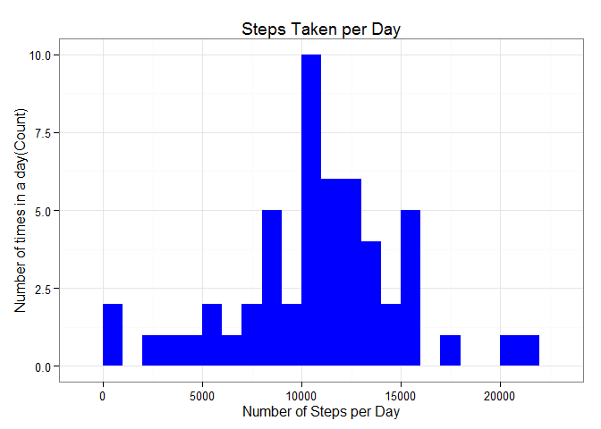

# Reproducible Research: Peer Assessment 1


## Loading and preprocessing the data


```r
# set the working directory and load the raw data
setwd("~/data science/Coursera/05 Reproducible Research/assign 1/RepData_PeerAssessment1")

unzip(zipfile="activity.zip")
rdata <- read.csv('activity.csv', header = TRUE, sep = ",",
                  colClasses=c("numeric", "character", "numeric"))


# Transform the date attribute to an actual date format
rdata$date <- as.Date(rdata$date, format = "%Y-%m-%d")
rdata$interval <- as.factor(rdata$interval)
```


## What is mean total number of steps taken per day?


```r
# calculating the total steps per day.
steps_per_day <- aggregate(steps ~ date, rdata, sum, na.rm = TRUE)
colnames(steps_per_day) <- c("date","steps")
head(steps_per_day)
```

```
##         date steps
## 1 2012-10-02   126
## 2 2012-10-03 11352
## 3 2012-10-04 12116
## 4 2012-10-05 13294
## 5 2012-10-06 15420
## 6 2012-10-07 11015
```

```r
# plot the histogram
library(ggplot2)
ggplot(steps_per_day, aes(x = steps)) + 
       geom_histogram(fill = "blue", binwidth = 1000) + 
        labs(title="Histogram of Steps Taken per Day", 
             x = "Number of Steps per Day", y = "Number of times in a day(Count)") + theme_bw() 
```

 

```r
# calculate the mean and medium of the steps
steps_mean   <- mean(steps_per_day$steps, na.rm=TRUE)
steps_mean
```

```
## [1] 10766.19
```

```r
steps_median <- median(steps_per_day$steps, na.rm=TRUE)
steps_median
```

```
## [1] 10765
```


## What is the average daily activity pattern?


```r
# calculate the aggregation of steps by intervals of 5-minutes 
steps_per_interval <- aggregate(rdata$steps, 
                                by = list(interval = rdata$interval),
                                FUN=mean, na.rm=TRUE)
steps_per_interval$interval <- 
        as.integer(levels(steps_per_interval$interval)[steps_per_interval$interval])
colnames(steps_per_interval) <- c("interval", "steps")

# plot the time series chart
library(ggplot2)
ggplot(steps_per_interval, aes(x=interval, y=steps)) +   
        geom_line(color="orange", size=1) +  
        labs(title="Average Daily Activity Pattern", x="5-minute interval", y="average number of steps taken") +  theme_bw()
```

 

```r
# find the highest
max_interval <- steps_per_interval[which.max(steps_per_interval$steps),]
max_interval
```

```
##     interval    steps
## 104      835 206.1698
```


## Imputing missing values


```r
# total number of missing values
missing_vals <- sum(is.na(rdata$steps))
missing_vals
```

```
## [1] 2304
```

```r
#replace the missing value
na_fill <- function(data, pervalue) {
        na_index <- which(is.na(data$steps))
        na_replace <- unlist(lapply(na_index, FUN=function(idx){
                interval = data[idx,]$interval
                pervalue[pervalue$interval == interval,]$steps
        }))
        fill_steps <- data$steps
        fill_steps[na_index] <- na_replace
        fill_steps
}

rdata_fill <- data.frame(  
        steps = na_fill(rdata, steps_per_interval),  
        date = rdata$date,  
        interval = rdata$interval)
str(rdata_fill)
```

```
## 'data.frame':	17568 obs. of  3 variables:
##  $ steps   : num  1.717 0.3396 0.1321 0.1509 0.0755 ...
##  $ date    : Date, format: "2012-10-01" "2012-10-01" ...
##  $ interval: Factor w/ 288 levels "0","5","10","15",..: 1 2 3 4 5 6 7 8 9 10 ...
```

```r
# to re-ensure there is not more missing value
Balance_fill <- sum(is.na(rdata_fill$steps))
Balance_fill
```

```
## [1] 0
```

```r
# plot a histogram of the total number of steps taken each day after filling missing values
fill_steps_per_day <- aggregate(steps ~ date, rdata_fill, sum)
colnames(fill_steps_per_day) <- c("date","steps")

##plotting the histogram
ggplot(fill_steps_per_day, aes(x = steps)) + 
       geom_histogram(fill = "blue", binwidth = 1000) + 
        labs(title="Histogram of Steps Taken per Day", 
             x = "Number of Steps per Day", y = "Number of times in a day(Count)") + theme_bw() 
```

 


## Are there differences in activity patterns between weekdays and weekends?


```r
# subset the data into weekends and weekdays
weekdays_steps <- function(data) {
    weekdays_steps <- aggregate(data$steps, by=list(interval = data$interval),
                          FUN=mean, na.rm=T)
    weekdays_steps$interval <- 
            as.integer(levels(weekdays_steps$interval)[weekdays_steps$interval])
    colnames(weekdays_steps) <- c("interval", "steps")
    weekdays_steps
}

data_by_weekdays <- function(data) {
    data$weekday <- 
            as.factor(weekdays(data$date)) # weekdays
    weekend_data <- subset(data, weekday %in% c("Saturday","Sunday"))
    weekday_data <- subset(data, !weekday %in% c("Saturday","Sunday"))

    weekend_steps <- weekdays_steps(weekend_data)
    weekday_steps <- weekdays_steps(weekday_data)

    weekend_steps$dayofweek <- rep("weekend", nrow(weekend_steps))
    weekday_steps$dayofweek <- rep("weekday", nrow(weekday_steps))

    data_by_weekdays <- rbind(weekend_steps, weekday_steps)
    data_by_weekdays$dayofweek <- as.factor(data_by_weekdays$dayofweek)
    data_by_weekdays
}

data_weekdays <- data_by_weekdays(rdata_fill)

#plot the charts

library(ggplot2)
ggplot(data_weekdays, aes(x=interval, y=steps)) + 
        geom_line(color="orange") + 
        facet_wrap(~ dayofweek, nrow=2, ncol=1) +
        labs(x="Interval", y="Number of steps") +
        theme_bw()
```

-1.png) 

